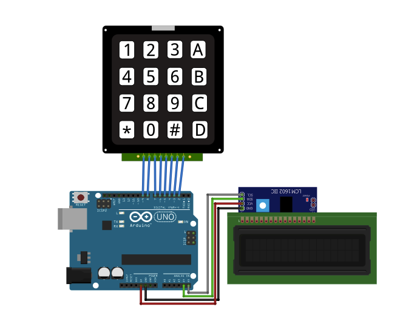

# Arduino Calculator

This calculator will be able to perform simple mathematical operations like addition, subtraction, multiplication, and division. It will also be able to give you the answer in float.

# How it works

In this project, 4×4 Keypad matrix is used as Calculator Keypad. On which, number buttons are used to write numbers and for arithmetic operator.

The buttons, other than the numerical ones, will perform the following tasks:

* ‘A’ is for addition
* ‘B’ is for subtraction
* ‘C’ is for multiply
* ‘D’ is for divide

You can change these, according to you by changing in [Arduino IDE](https://www.arduino.cc/en/main/software) code.

## Required Hardware

Following Hardware will be required to perform this circuit.

1.   Arduino UNO     
2.   8 by 2 LCD screen
3.   4X4 Keypad Matrix   
4.   Male to Female Jumper   
5.   Male to Male Jumper     
6.    USB A to B cable (cable differs between arduino models)
7.    9v battery power plug 

## Complete circuit diagram

## Tutorial 

1. See  [Arduino Tutorial](https://www.youtube.com/watch?v=QO_Jlz1qpDw&list=PLGLfVvz_LVvSzj85mDoDm_DTOADEY_5c5&ytbChannel=null)
2. See  [ How to Build a Simple Arduino Calculator](https://www.youtube.com/watch?v=XXonpVubg94&ytbChannel=null)

